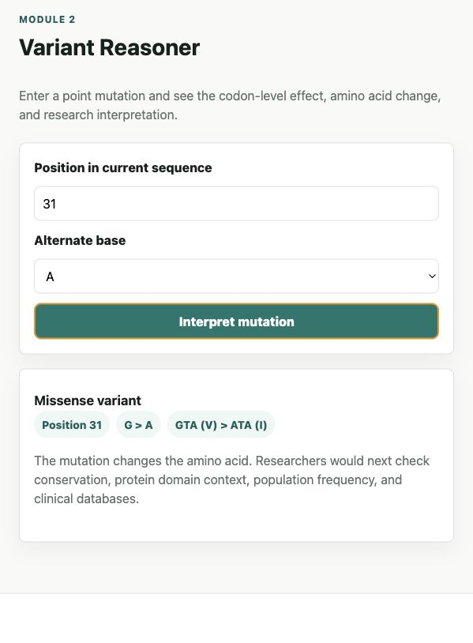

# Genome Insight Lab

Genome Insight Lab is a portfolio-ready bioinformatics analytics app for learning medical genomics through direct interaction. It is designed for undergraduate bioinformatics students who want a clear project that demonstrates biological understanding, data analysis, and front-end implementation skill.



## Project Summary

The app turns DNA sequence and small expression datasets into understandable research-style outputs. It is intentionally educational: each module explains why the calculation matters in medical research while keeping the interface straightforward.

This is not a clinical diagnostic tool. It is a learning and portfolio project that demonstrates core ideas behind modern genomic analysis.

## Features

- FASTA and raw DNA cleanup.
- Sequence length, nucleotide composition, GC content, and CpG observed/expected ratio.
- Candidate open reading frame discovery.
- DNA-to-protein translation for ORFs.
- Codon-level point mutation interpretation.
- Variant categories including silent, missense, nonsense, stop-loss, and no-change.
- Illustrative tumor-versus-normal expression explorer.
- Heatmap-style expression visualization.
- Learning notes that connect app outputs to medical genomics.

## Why This Matters

Bioinformatics is central to modern medical research. Researchers use sequence analysis, mutation interpretation, and expression profiling to study cancer biology, inherited disease, drug targets, biomarkers, and molecular pathways. Genome Insight Lab gives learners a compact way to practice these concepts without needing a complex pipeline first.

## Tech Stack

- HTML
- CSS
- JavaScript
- Canvas-based charts and DNA visualization
- No external dependencies

## Project Structure

```text
genome-insight-lab/
├── assets/
│   ├── app.js
│   └── styles.css
├── tests/
│   └── project-smoke.test.js
├── index.html
├── package.json
├── README.md
├── LICENSE
└── .gitignore
```

## How to Run

Open `index.html` directly in a browser, or run a local preview server:

```bash
npm start
```

Then visit:

```text
http://127.0.0.1:4173
```

## How to Test

```bash
npm test
```

The test checks that the app files exist, the JavaScript parses correctly, and the expected bioinformatics modules are present.

## GitHub Pages Deployment

1. Create a new GitHub repository.
2. Upload the contents of this folder.
3. In GitHub, open repository settings.
4. Go to Pages.
5. Choose deployment from the main branch.
6. Use the repository root as the Pages source.
7. Open the generated GitHub Pages URL.

## Portfolio Talking Points

- Built an educational bioinformatics application from scratch.
- Implemented sequence parsing, GC/CpG metrics, ORF discovery, translation, and mutation interpretation.
- Designed a medically relevant interface focused on cancer genomics concepts.
- Created a static project that is easy to deploy with GitHub Pages.
- Communicated scientific results in learner-friendly language.

## Suggested Future Improvements

- Add CSV upload for expression matrices.
- Add reverse-complement analysis and six-frame translation.
- Export sequence and variant reports as PDF or JSON.
- Add user-supplied expression datasets.
- Connect to public resources such as NCBI, Ensembl, ClinVar, or GEO.
- Add unit tests for every sequence and variant interpretation function.
